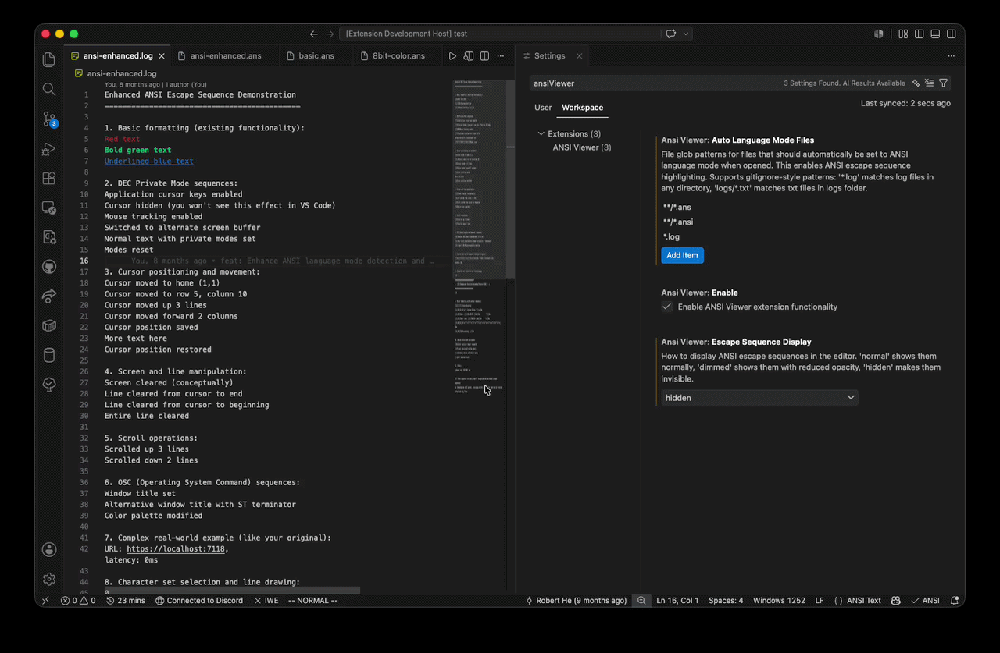
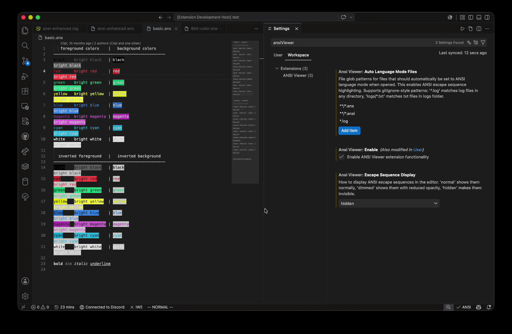
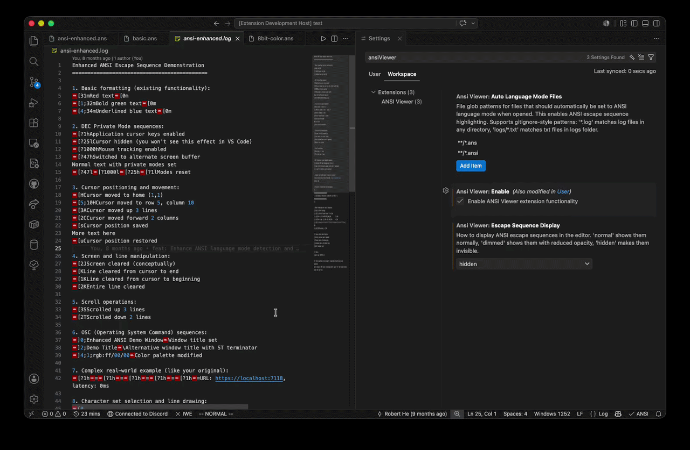

# ANSI Viewer

ANSI Color styling and previewer for your text editor.

[](https://marketplace.visualstudio.com/items?itemName=HNRobert.ansi-viewer)
[](https://github.com/hnRobert/vscode-ansi-viewer)
[](LICENSE)
[](https://github.com/hnRobert/vscode-ansi-viewer/issues)
[](https://github.com/hnRobert/vscode-ansi-viewer/issues?q=is%3Aissue+is%3Aclosed)

> Forked from [iliazeus/vscode-ansi](https://github.com/iliazeus/vscode-ansi) and enhanced with more complete ANSI escape code and additional function support.

## Demo

### Enable / Disable



### Switch Normal / Dim / Hidden



### Apply matching file glob rules for workspace



## Basic usage

Select the `ANSI Text` language mode to highlight text marked up with ANSI escapes. Files with the `.ans` and `.ansi` extensions will be highlighted by default.


Run the `ANSI Text: Open Preview` command for the prettified read-only preview.


Clicking the preview icon in the editor title will open the preview in a new tab. `Alt`-click to open in the current tab.


The extension fetches the colors from the current theme and aims to look as good as the built-in terminal.


## Supported ANSI escape codes (Enhanced)

This extension now supports a comprehensive range of ANSI escape sequences including:

- **SGR (Select Graphic Rendition)**: Colors, text formatting (bold, italic, underline, etc.)
- **Cursor Control**: Position (H, f), movement (A-G), save/restore (s, u)
- **DEC Private Modes**: Terminal behaviour control (?...h/?...l) for cursor visibility, mouse tracking, alternate screen
- **Screen Manipulation**: Erase sequences (J, K), scroll control (S, T)
- **OSC Commands**: Window titles, color palette control, clipboard operations
- **Character Sets**: ASCII, line drawing, and international character sets
- **Device Queries**: Status reports and device attributes

### Visual Examples

Basic colors and formatting:


8-bit colors:


24-bit colors:


## FAQ

- Can files automatically be set to ANSI language mode?

  You can configure automatic ANSI language mode for files matching specific glob patterns. By default, `.ans` and `.ansi` files will automatically be set to ANSI language mode when opened, enabling escape sequence highlighting.

  You can customize this behaviour in VS Code settings using gitignore-style patterns:

  ```jsonc
  {
    "ansiViewer.autoLanguageModeFiles": [
      "**/*.ans",
      "**/*.ansi",
      "*.log", // All .log files in any directory
      "logs/*.txt", // .txt files in logs folder
      "output.txt", // Specific filename
      "build/**" // All files in build directory
    ]
  }
  ```

  **Pattern support:**
  - `*.log` - matches `.log` files in any directory (same as `**/*.log`)
  - `logs/*.txt` - matches `.txt` files only in `logs` folder
  - `build/**` - matches all files in `build` directory and subdirectories
  - `output.txt` - matches files named exactly `output.txt`

  Set it to an empty array `[]` to disable automatic language mode setting entirely.
